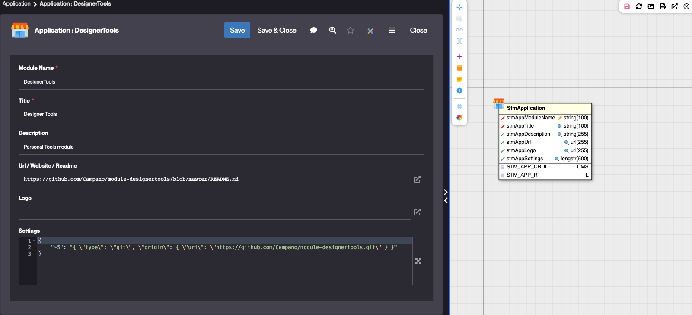
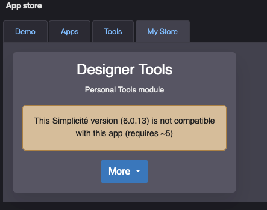

<!--
 ___ _            _ _    _ _    __
/ __(_)_ __  _ __| (_)__(_) |_ /_/
\__ \ | '  \| '_ \ | / _| |  _/ -_)
|___/_|_|_|_| .__/_|_\__|_|\__\___|
            |_| 
-->

* * *

# Simplicité AppStore Manager

This modules allos to managa a Simplicité AppStore.

1. Configure your apps in the store manager (you can import the dataset to get an example of app)

2. Append the URL the Store Manager API (`<instance_url>/ext/StmApi`) to the `STORE_SOURCE` JSON system param of the instance you want to access the store from.

3. Clear the cache on that instance and verify that you gained access to the store

